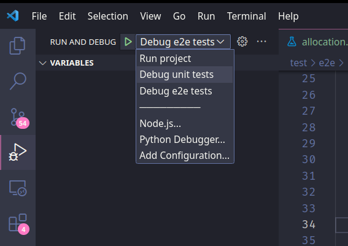
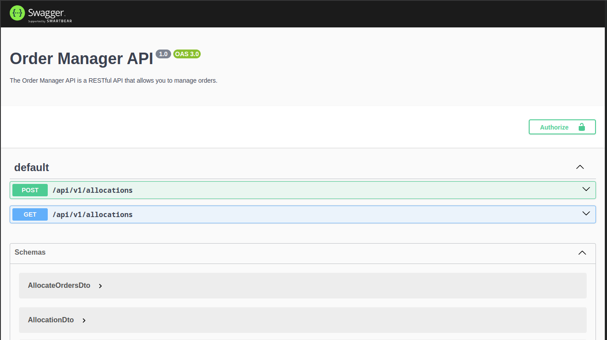

# Order Manager Back

This repository is a mini project to allocate Sales Orders against Purchase Orders.

The system will allocate the Sales Orders based on the FIFO (First In First Out) rule considering the receiving date of the Purchase Orders.

## Architecture

The project was built based on [Clean Architecture](https://blog.cleancoder.com/uncle-bob/2012/08/13/the-clean-architecture.html) of Uncle Bob.

The project is divided into 4 layers:

- **[Domain](src/domain)**: This layer is responsible for the business rules and the entities of the system. It is the most important and inner layer of the system, because it is where the enterprise business rules are implemented.

- **[Application](src/application)**: This layer is responsible for the application business rules and the use cases of the system. It is the layer that orchestrates the flow of the system.

- **[Infrastructure](src/infra)**: This layer is responsible for the external tools and frameworks that the system uses. It is the layer that communicates with the external world. So here we have the real implementation of the repositories, the database, the external services, etc.

- **[Nest/Main/Interface](src/nest)**: This layer is responsible for the communication between the system and the external world. It is the layer that receives the requests and sends the responses. It is the layer that communicates with the external world. Here we have [NestJS](https://github.com/nestjs/nest) and the REST API for example.

## Installation

```bash
$ npm install
```

## Running the app

First of all, rename the `.env.example` file to `.env` and fill the environment variables.

Then, you can run the app using the following command:

```bash
# development
$ npm run start

# watch mode
$ npm run start:dev

# production mode
$ npm run start:prod
```

## Test

```bash
# unit tests
$ npm run test

# e2e tests
$ npm run test:e2e

# test coverage
$ npm run test:cov
```

## Debug

You can use the `Run and Debug` feature of Visual Studio Code to debug the application.



It's useful if you want to add some breakpoints and see the values of the variables and the flow of the application.

## Testing/visualizing the allocation

After running the application, open your browser and go to the following URL: [http://localhost:3000/api](http://localhost:3000/api)

You will see the Swagger UI with the endpoints of the application.



If you initially execute `GET /allocations`, you'll receive a empty list of allocations.

You'll need to execute the `POST /allocations` endpoint to create the allocations.

After that, you can execute the `GET /allocations` endpoint to see the allocations.

Main files to look at:

- [src/application/usecases/allocate-orders.ts](src/application/usecases/allocate-orders.ts#L125): This is the usecase that fetches the sales and purchase orders and allocates them.
- [src/infra/in-memory](src/infra/in-memory): This is the in-memory implementation of the repositories. It's useful for testing and development and contains the initial sales and purchase orders.
- [src/nest/allocation.controller.ts](src/nest/allocation.controller.ts): This is the controller that handles the requests and responses of the application.
- [test/unit/application/usecases/allocate-orders.spec.ts](test/unit/application/usecases/allocate-orders.spec.ts): This is the test file for the usecase that fetches the sales and purchase orders and allocates them.

## Potential improvements

Refer to the [improvements.md](docs/improvements.md) file for a list of potential improvements.

## Author

Developed by Plinio Naves

- Email: [pliniopjn@gmail.com](mailto:pliniopjn@gmail.com)
- Linkedin: [linkedin.com/in/plinionaves](https://www.linkedin.com/in/plinionaves)
- Twitter: [@plinionaves](https://twitter.com/plinionaves)
- Github: [github.com/plinionaves](https://github.com/plinionaves)
